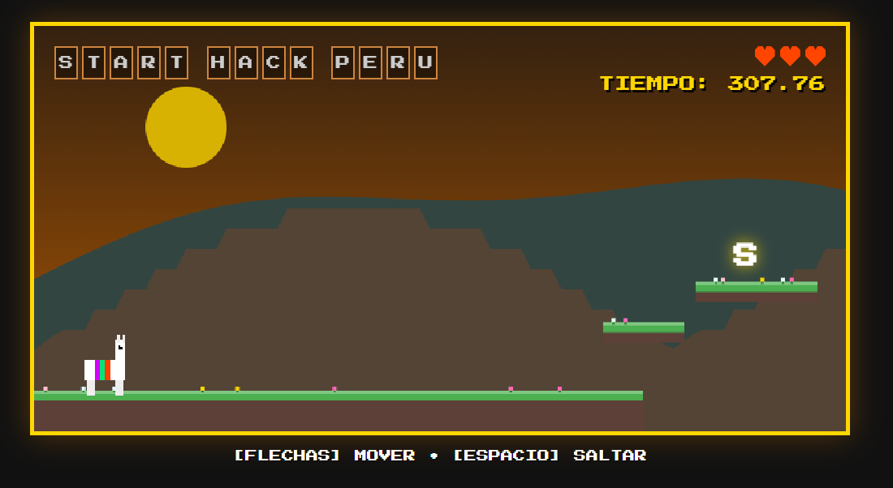

# 🦙 Llama Hackathon Adventure - Fixed Edition


## Galería

Aquí puedes ver cómo luce el juego:

| Menú Principal | Gameplay |
| :---: | :---: |
|  |  |

**Llama Hackathon Adventure** es un juego de plataformas de estilo *pixel-art* retro que corre directamente en el navegador. Controla a una intrépida llama peruana a través de diversos paisajes, recolectando letras para formar frases icónicas del ecosistema de startups y hackathones.

---

## Características del Juego

* **Motor Gráfico Propio:** Desarrollado desde cero utilizando HTML5 Canvas y JavaScript puro (Vanilla JS), sin librerías externas.
* **Física de Plataformas:** Sistema de gravedad, colisiones AABB (Axis-Aligned Bounding Box), saltos y fricción.
* **Mecánicas Clásicas:**
    * Recolectar letras flotantes para completar el nivel.
    * Bloques misteriosos interactivos (estilo Mario Bros).
    * Sistema de vidas (3 corazones).
* **Estética Peruana:**
    * Personaje principal: Una llama con manta colorida.
    * Fondos con efecto **Parallax** (montañas y atardeceres).
    * Meta final con la bandera del Perú 🇵🇪.
* **UI Reactiva:** Menú de selección de niveles, temporizador en tiempo real y pantallas de Game Over/Victoria.

## Controles

| Acción | Tecla |
| :--- | :--- |
| **Moverse** | `Flechas Izquierda / Derecha` |
| **Saltar** | `Barra Espaciadora` o `Flecha Arriba` |
| **Seleccionar Nivel** | `Click` en el menú principal |

## Niveles Disponibles

El juego cuenta con frases temáticas que el jugador debe completar:

1.  **Crafter Station**
2.  **IA Playgrounds**
3.  **Start Hack Peru**
4.  **Yavendio!**
5.  **Inspira Tech**
6.  **Hackeando Productos**

## Instalación y Ejecución

Este juego no requiere instalación de dependencias ni servidores complejos. Es un archivo autocontenido.

1.  **Clona el repositorio:**
    ```bash
    git clone [https://github.com/shiarauzo/VibecodedGame.git](https://github.com/shiarauzo/VibecodedGame.git)
    ```
2.  **Ejecuta el juego:**
    * Simplemente abre el archivo `index.html` en tu navegador web favorito (Chrome, Firefox, Edge).
    * O haz doble clic en el archivo descargado.

## Tecnologías Usadas

* **HTML5:** Estructura del contenedor y Canvas.
* **CSS3:** Estilos "Pixel Art" (fuente 'Press Start 2P'), animaciones de UI y diseño responsivo del contenedor.
* **JavaScript (ES6+):** Lógica del bucle de juego (Game Loop), renderizado, gestión de estados y detección de colisiones.

---

Hecho con ❤️ 